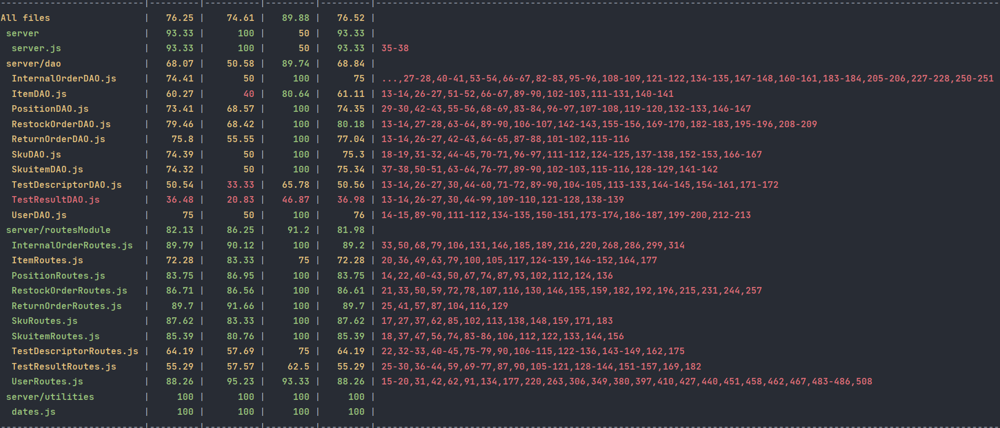

# Integration and API Test Report

Date: 21/06/2022

Version: 2

# Contents

- [Dependency graph](#dependency graph)

- [Integration and API Test Report](#integration-and-api-test-report)
- [Contents](#contents)
- [Dependency graph](#dependency-graph)
- [Integration approach](#integration-approach)
- [Integration Tests](#integration-tests)
  - [Step 1](#step-1)
  - [Step 2](#step-2)
- [API testing - Scenarios](#api-testing---scenarios)
- [Coverage of Scenarios and FR](#coverage-of-scenarios-and-fr)
- [Coverage of Non Functional Requirements](#coverage-of-non-functional-requirements)
    - 

- [Tests](#tests)

- [Scenarios](#scenarios)

- [Coverage of scenarios and FR](#scenario-coverage)
- [Coverage of non-functional requirements](#nfr-coverage)

# Dependency graph 

     
# Integration approach

    The integration approach used is **top down**.

* **Step 1**: API classes tested 
* **Step 2**: DAO classes tested
    

#  Integration Tests

   <define below a table for each integration step. For each integration step report the group of classes under test, and the names of
     Jest test cases applied to them, and the mock ups used, if any> Jest test cases should be here code/server/unit_test

## Step 1
| Classes  | mock up used |Jest test cases |
|--|--|--|
|Internal Order| POST to /api/sku is done before test|   getInternalOrders(), getInternalOrdersIssued(), getInternalOrdersAccepted(), getinternalOrdersById(), newInternalOrder(), editInternalOrder(), deleteInternalOrder()|
|SKU |  | addTest(), newPosition(), newSku(), getSkus(), getSku(), updateSku(), updateSkuPosition(), deleteSku() |
|SKU Item |  |newSku(), newSkuitem(),updateSkuitem(), getSkuitems(),getSkuitem(), getAvailableSkuitem(), deleteSkuitem() |
|Position |  | newPosition(), updatePosition(), updatePositionID(), getPositions(), deletePosition() |
|Restock Order |  | addRestockOrder(), getAllRestockOrders(), getAllRestockOrdersIssued(), getRestockOrderById(), getAllReturnablesById(), updateRestockOrder(), updateRestockOrderSKUItems(),updateRestockOrderTransportNote(), deleteRestockOrder()|
|Return Order |  |addReturnOrder(),getAllReturnOrders(),getReturnOrderById(), deleteReturnOrder()  |
|Item |  | getAllItems(), getItem(), addItem(), modItem()|
|Test Descriptor |  |getAllTests(), getTest(), addTest(), modTest() |
|Test Result |  | getAllResultsRFID(), addResult(),modResult()|
|User |  | getSuppliers(), getUsers(), newUser(), newManager(), managerSessions(), customerSessions(), supplierSessions(), clerkSessions(), qualityEmployeeSessions(), deliveryEmployeeSessions(), editUser(), deleteUser() |

## Step 2
| Classes  | mock up used |Jest test cases |
|--|--|--|
|InternalOrderDAO|  | testAddInternalOrder(), testAddInternalOrderProducts(), testCheckIfOrderExists(), testUpdateInternalOrder(), testUpdateInternalOrderProduct(), testDeleteInternalOrder(), testDeleteInternalOrderProducts(), testGetInternalOrder(), testGetInternalOrderProducts(), testGetInternalOrderProductsCompleted(), testGetInternalOrdersByState(),testGetInternalOrdersbyID() |
|SkuDAO||testgetSku(), testgetSkus()|
|SkuitemDAO||testgetSkuitem(), testgetSkuitems(), testgetAvailableSkuitem()|
|PositionDAO||testUpdatePosition(), testChangePosition(), testUpdateDimensions()|
|RestockOrderDAO||testAddRestockOrder(), testCheckIfStored(), testGetIssuedRestockOrders(), testGetAllRestockOrders(), testGetIssuedOrder(), testGetNotIssuedOrder(), testGetDeliveryOrder(), testUpdateState(), testUpdateTransportNote(), testUpdateSkuItems(), testDeleteRestockOrder()    |
|ReturnOderDAO||testAddReturnOrder(), testGetAllReturnOrders(), testCheckIfRestockOrderIsStored(), testDeleteReturnOrder()  |
|ItemDAO| |testAddItem(), testEditItem(), testGetItems(), testGetItem(), testDeleteItem(), testDeleteAllItems |
|TestDescriptorDAO| |testAddTest(), testEditTest(), testGetTests(), testGetTest(), testFindName(), testIdFromSku(), testDeleteTest(), testDeleteAllTests()|
|TestResultDAO| |testAddResult(), testEditResult(), testGetResultsRfid(), testGetResultsRfidId(), countFailed(), testDeleteResult(), testDeleteAllResults() |
|UserDAO|| testAddUser(), testEditUser(), testCheckStored(), testGetUserByEmailType(), testGetUsers(), testGetSuppliers(), testGetUsersWithoutManagers(), testDeleteUser()|

# API testing - Scenarios

# Coverage of Scenarios and FR

<Report in the following table the coverage of  scenarios (from official requirements and from above) vs FR. 
Report also for each of the scenarios the (one or more) API Mocha tests that cover it. >  Mocha test cases should be here code/server/test

| Scenario ID | Functional Requirements covered | Mocha  Test(s) | 
| ----------- | ------------------------------- | ----------- | 
|  1.1         | FR2.1          | newSku()            |             
|  1.2         | FR2.1        | updateSkuPosition()            |             
| 1.3        | FR2.1       | updateSku()            |             
| 2.1        | FR3.1.1           | newPosition()            |             
| 2.2        | FR3.1.1          | updatePositionID()           |             
| 2.3       | FR3.1.1             | updatePosition()            |          
| 2.4       | FR3.1.1                | updatePosition()            |             
| 2.5    | FR3.1.2              | deletePosition()            |             
| 3.1     | FR5.1, FR5.2, FR5.3, FR5.5                                | addRestockOrder(),              |             
| 3.2       | FR5.1, FR5.2, FR5.3, FR5.5                                 | addRestockOrder(),            |             
| 4.1      | FR1.1, FR4.1                       | newUser()            |             
| 4.2       | FR1.1, FR1.3, FR1.4, FR4.1, FR4.3, FR4.4        | editUser(), getUsers()            |             
| 4.3       | FR1.2, FR1.3, FR1.4, FR4.2, FR4.3, FR4.4        | deleteUser(), getUsers()            |             
| 5.1.1      | FR5.7                                | updateRestockOrder()             |             
| 5.2.1      | FR5.7                                | updateRestockOrder()            |             
| 5.2.2       | FR5.7                                | updateRestockOrder()            |             
| 5.2.3       | FR5.7                                | updateRestockOrder()            |             
| 5.3.1        | FR5.7                                | updateRestockOrder()            |             
| 5.3.2        | FR5.7                                 | updateRestockOrder()             |             
| 5.3.3      |  FR5.7                               | updateRestockOrder()             |             
| 6.1     |  FR5.9, FR5.10, FR5.11                               | getAllReturnablesById(), addReturnOrder()            |       
| 6.2     |  FR5.9, FR5.10, FR5.11                                | getAllReturnablesById(), addReturnOrder()             |             
| 7.1     | FR1.5            | managerSessions(), customerSessions(), supplierSessions(), clerkSessions(), qualityEmployeeSessions(), deliveryEmployeeSessions()            |             
| 7.2      |                                 | Not to be implemented yet            |             
| 9.1    | FR6.1, FR6.2, FR6.3, FR6.4, FR6.5, FR6.6, FR6.7 | newInternalOrder(), getInternalOrdersIssued(), editInternalOrder()           |             
| 9.2     | FR6.1, FR6.2, FR6.3, FR6.4, FR6.5, FR6.6, FR6.7 | newInternalOrder(), getInternalOrdersIssued(), editInternalOrder()            |             
| 9.3       | FR6.1, FR6.2, FR6.3, FR6.4, FR6.5, FR6.6, FR6.7 | newInternalOrder(), getInternalOrdersIssued(), editInternalOrder()             |             
| 10.1      | FR6.7, FR6.8      | getInternalOrdersAccepted(), editInternalOrder()             |   
| 11.1      | FR4 FR4.6         | countItems(), addItem() |             
| 11.2      | FR4 FR4.6         |  updateItem(), countItems(),getItem()|           
| 12.1      | FR4.1             | findTestName(),addTest(), countSku()            |             
| 12.2      | FR4.1             | findTestName(), updateTest()          |             
| 12.3      |FR4.1              |deleteTest(),  findTestId()           |             

# Coverage of Non Functional Requirements

<Report in the following table the coverage of the Non Functional Requirements of the application - only those that can be tested with automated testing frameworks.>

### 

| Non Functional Requirement | Test name |
| -------------------------- | --------- |
| NFR4                          | updatePosition() //wrong id          |
| NFR5                          | db autogenerates 12 digits sku.id          |
| NFR6                           | newSkuitem() //Too short rfid          |
| NFR9                           | (Jest) dates.test.js, addRestockOrder(), addReturnOrder()     |

