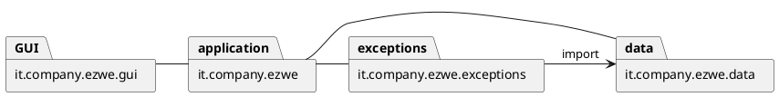
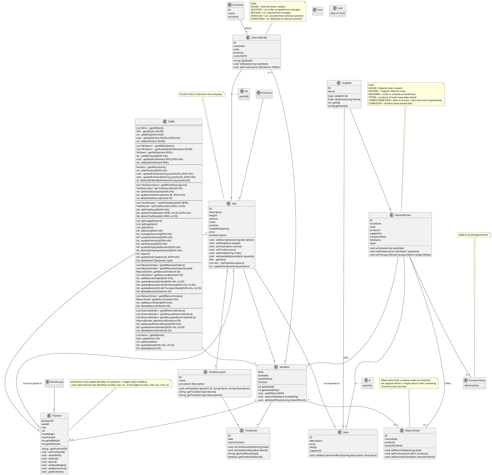

# Design Document 

Authors: 

Date:

Version:

# Contents

- [Design Document](#design-document)
- [Contents](#contents)
- [Instructions](#instructions)
- [High level design](#high-level-design)
- [Low level design](#low-level-design)
- [Verification traceability matrix](#verification-traceability-matrix)
- [Verification sequence diagrams](#verification-sequence-diagrams)

# Instructions

The design must satisfy the Official Requirements document, notably functional and non functional requirements, and be consistent with the APIs

# High level design 

discuss architectural styles used, if any
MVC...

# Low level design

# Verification traceability matrix

|   | EzWh |User| Supplier | Customer  | Item | A | RestockOrder | TranportNote | ReturnOrder | SKU | Inventory | SKUItem | AA | TestDescriptor | AAA | TestResult | Position | InternalOrder |  
| ----------------- |:-----------:|:-----------:|:-----------:|:-----------:|:-----------:|:-----------:|:-----------:|:-----------:|:-----------:|:-----------:|:-----------:|:-----------:|:-----------:|:-----------:|:-----------:|:-----------:|:-----------:|:-----------:|
|  FR1     |X|X|||||||||||||||||
| FR2    |X|||||||||X||X|||||||
| FR3    |X|||||||||X|X|X||X||X|X||
| FR4     |X|||X|||||||||||||||
| FR5    |X||X||X||X|X|||||||X||||
| FR6  | X |||||X|X||||||X|||||X|
| FR7  | X |||||||||X|X|X|||||||

# Verification sequence diagrams 
\<select key scenarios from the requirement document. For each of them define a sequence diagram showing that the scenario can be implemented by the classes and methods in the design>

