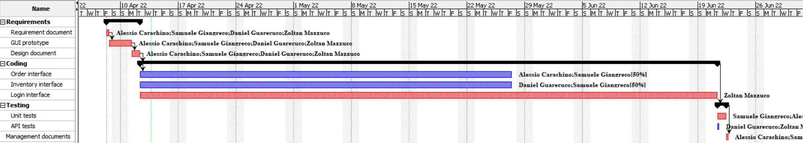

# Project Estimation  
Date:
13/04/2022

Version:
0.1

# Estimation approach
Consider the EZWH  project as described in YOUR requirement document, assume that you are going to develop the project INDEPENDENT of the deadlines of the course
# Estimate by size
### 
|             | Estimate                        |             
| ----------- | ------------------------------- |  
| NC =  Estimated number of classes to be developed                 | 20                         |             
|  A = Estimated average size per class, in LOC                     | 200                           | 
| S = Estimated size of project, in LOC (= NC * A)                  | 4000                               |
| E = Estimated effort, in person hours (here use productivity 10 LOC per person hour)  | 400                                     |   
| C = Estimated cost, in euro (here use 1 person hour cost = 30 euro)                   | 12000          | 
| Estimated calendar time, in calendar weeks (Assume team of 4 people, 8 hours per day, 5 days per week ) | 2.5                  |               

# Estimate by product decomposition
### 
|         component name    | Estimated effort (person hours)   |             
| ----------- | ------------------------------- | 
|Requirement document   | 30 |
|GUI prototype          | 10 |
|Design document        | 30 |
|Code                   | 400|
|Unit tests             | 20 |
|API tests              | 10 |
|Management documents   | 20 |

# Estimate by activity decomposition
### 
|         Activity name    | Estimated effort (person hours)   |             
| ----------- | ------------------------------- | 
|Requirement document   | 40 |
|GUI prototype          | 16 |
|Design document        | 40 |
|Code                   | 464|
|Unit tests             | 24 |
|API tests              | 16 |
|Management documents   | 24 |

###

# Summary

Report here the results of the three estimation approaches. The  estimates may differ. Discuss here the possible reasons for the difference

|             | Estimated effort                        |   Estimated duration |          
| ----------- | ------------------------------- | ---------------|
| estimate by size                   |400|  2.5 Weeks |
| estimate by product decomposition  |520|  3.25 Weeks |
| estimate by activity decomposition |624 | X Week |

