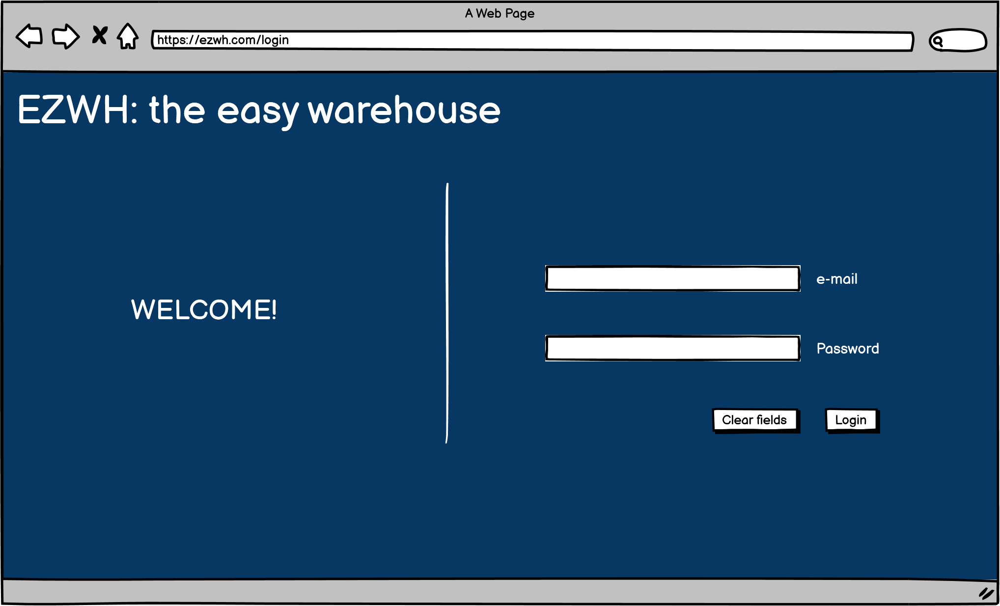

# Graphical User Interface Prototype  

Authors: 
* Alessio Carachino
* Samuele Giangreco
* Daniel Guarecuco
* Zoltan Mazzuco

Date: 13 april 2022

Version: #1

# Screenshots

## Case 1 - Log-in

### Regular Log-in

This is the view presented to all users trying to use the application. If any user tries to connect to any other page without being authenticated, they will be redirected here for login.

* The user is requested to provide e-mail and password.
* The ***Login*** button send the form for authentication with the backend.
  * If it is the first time the user tries to log in, they will be redirected to the [Firt-time log-in](#firt-time-log-in) screen.
  * Otherwise, they will be redirected to the [Dashboard](#case-2-dashboard) screen.

### Firt-time Log-in

This view is presented to all users that are trying to access the application for the first time after the administrator have created their accounts. They are requested to change their default password. Failure to change the password will reject the authentication.
* By pressing ***Submit*** the user is redirected to the [Dashboard](#case-2-dashboard) screen.

## Case 2 - Dashboard

## Case 3 - Manage items

### Edit items

## Case 4 - Manage users

### New employee

### New supplier

### Manage users

### Edit user

## Case 5 - Manage orders

### List orders to suppliers

### Order details

### List internal orders

### Placing orders

### Placing orders to suppliers

## Case 6 - Manage suppliers
### Manage supplier

### Edit supplier

### Add item supplier

### Supplier catalogue

## Case 7 - Quality check

## Case 8 - Show warehouse

