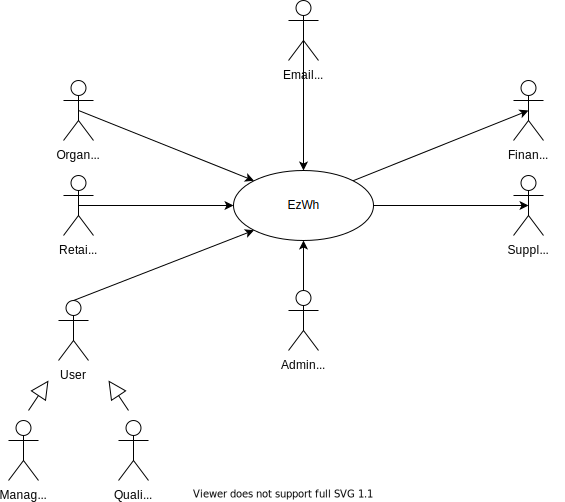
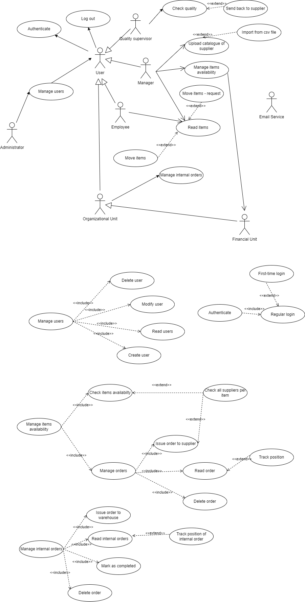
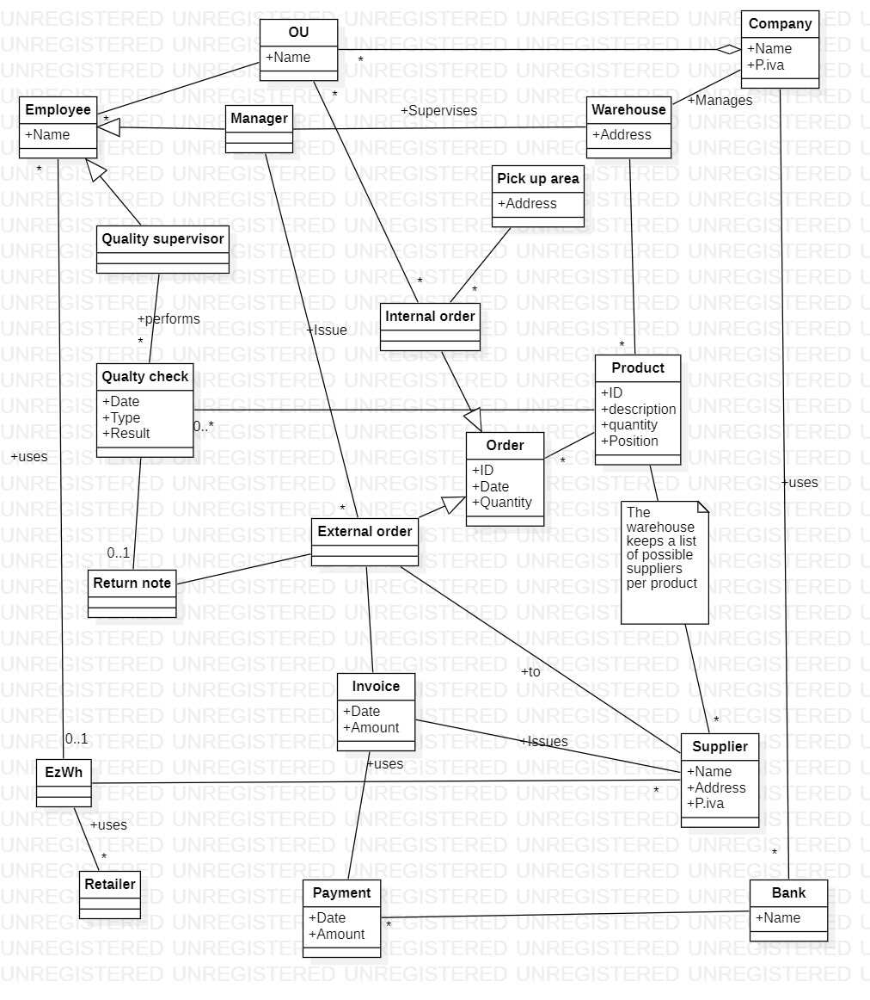
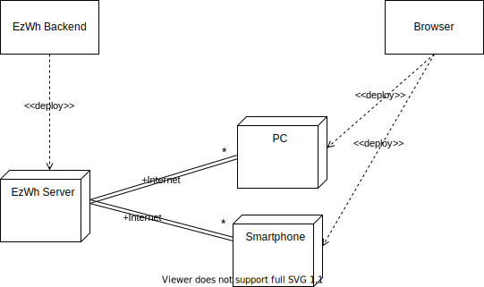

 #Requirements Document 

Authors: 
* Alessio Carachino
* Samuele Giangreco
* Daniel Guarecuco
* Zoltan Mazzuco

Date: 22 march 2022

Version: 0.4

 
| Version number 	| Change 	 |
| ----------------- |:-----------|
| 0.1 				| Describing stakeholders, adding a few UCs			| 
| 0.2 				| Describing stakeholders in detail, adding more UCs| 
| 0.3 				| Adding more UCs + various fixes and improvements to old UCs| 
| 0.4 				| Adding deployment diagram, fixing FR/NFR| 

# Contents

- [Contents](#contents)
- [Informal description](#informal-description)
- [Stakeholders](#stakeholders)
- [Context Diagram and interfaces](#context-diagram-and-interfaces)
	- [Context Diagram](#context-diagram)
	- [Interfaces](#interfaces)
- [Stories and personas](#stories-and-personas)
- [Functional and non functional requirements](#functional-and-non-functional-requirements)
	- [Functional Requirements](#functional-requirements)
	- [Non Functional Requirements](#non-functional-requirements)
- [Use case diagram and use cases](#use-case-diagram-and-use-cases)
	- [Use case diagram](#use-case-diagram)
		- [Use case 1, UC1 - Manage users](#use-case-1-uc1---manage-users)
				- [Scenario 1.1](#scenario-11)
				- [Scenario 1.2](#scenario-12)
				- [Scenario 1.3](#scenario-13)
				- [Scenario 1.4](#scenario-14)
		- [Use case 2, UC2 - Authenticate](#use-case-2-uc2---authenticate)
				- [Scenario 2.1](#scenario-21)
				- [Scenario 2.2](#scenario-22)
		- [Use case 2.5, UC2.5 - Logout](#use-case-25-uc25---logout)
		- [Use case 3, UC3 - Manage items availability](#use-case-3-uc3---manage-items-availability)
				- [Scenario 3.1](#scenario-31)
				- [Scenario 3.2](#scenario-32)
				- [Scenario 3.3](#scenario-33)
				- [Scenario 3.4](#scenario-34)
				- [Scenario 3.5](#scenario-35)
				- [Scenario 3.6](#scenario-36)
				- [Scenario 3.7](#scenario-37)
		- [Use case 4, UC4 - Manage internal orders](#use-case-4-uc4---manage-internal-orders)
				- [Scenario 4.1](#scenario-41)
				- [Scenario 4.2](#scenario-42)
				- [Scenario 4.3](#scenario-43)
				- [Scenario 4.4](#scenario-44)
				- [Scenario 4.5](#scenario-45)
		- [Use case 5, UC5 - Check quality](#use-case-5-uc5---check-quality)
				- [Scenario 5.1](#scenario-51)
		- [Use case 6, UC6 - Read items](#use-case-6-uc6---read-items)
				- [Scenario 6.1](#scenario-61)
				- [Scenario 6.2](#scenario-62)
		- [Use case 7, UC7 - Upload catalogue of supplier](#use-case-7-uc7---upload-catalogue-of-supplier)
				- [Scenario 7.1](#scenario-71)
		- [Use case 8, UC8 - Send email](#use-case-8-uc8---send-email)
- [Glossary](#glossary)
- [System Design](#system-design)
- [Deployment Diagram](#deployment-diagram)

# Informal description
Medium companies and retailers need a simple application to manage the relationship with suppliers and the inventory of physical items stocked in a physical warehouse. 
The warehouse is supervised by a manager, who supervises the availability of items. When a certain item is in short supply, the manager issues an order to a supplier. In general the same item can be purchased ~~by~~ from many suppliers. The warehouse keeps a list of possible suppliers per item. 

After some time the items ordered to a supplier are received. The items must be quality checked and stored in specific positions in the warehouse. The quality check is performed by specific roles (quality office), who apply specific tests for item (different items are tested differently). Possibly the tests are not made at all, or made randomly on some of the items received. If an item does not pass a quality test it may be rejected and sent back to the supplier. 

Storage of items in the warehouse must take into account the availability of physical space in the warehouse. Further the position of items must be traced to guide later recollection of them.

The warehouse is part of a company. Other organizational units (OU) of the company may ask for items in the warehouse. This is implemented via internal orders, received by the warehouse. Upon reception of an internal order the warehouse must collect the requested item(s), prepare them and deliver them to a pick up area. When the item is collected by the other OU the internal order is completed. 

EZWH (EaSy WareHouse) is a software application to support the management of a warehouse.

# Stakeholders

| Stakeholder name  		| Description | 
| ----------------- 		|:-----------|
|   Manager		    		| Uses the application to issue, delete or edit orders to suppliers    | 
|   Quality supervisor    	| Uses the application to rate the quality of the items				   | 
|   Retailer     			| Uses the application to issue, delete or edit orders to the Warehouse|
|   Company's OU    		| Uses the application to issue, delete or edit orders to the Warehouse|  
|   Employee	   			| Uses the applicaiton to list orders					               | 
|   Financial Unit  		| A specialized unit that must pay the orders coming via email from the manager |
|   Email Service			| The application needs an email service in order to create and send emails in a facilitated way	|
|   Physical organization  	| Application maps the physical layout of the Warehouse, used for internal item tracking  | 
|   Pick up area  			| Physical space at the Warehouse where to place items to be picked up | 
|   Administrator   		| Defines roles of all involved parties that use the application       | 
|   Supplier	   			| Sell items to the warehouse. Get the order of items by email  	   | 
|   Shipping company     	| Ships items from the supplier to the warehouse. Get addresses by email |
|   Competitor      		| Competitors within the same sector            					   | 
|   Local policy 	  		| Regulates physical space, allowed items, licenses        			   | 
|   Payment Service 		| Handles payment between parties. Not covered by the EZWZ         	   |

# Context Diagram and interfaces

## Context Diagram

## Interfaces

| Actor | Logical Interface | Physical Interface  |
| ------------- |:-------------:| :-----|
|   Employee     		| GUI | Internet connection, Smartphone/PC |
|   User     			| GUI | Internet connection, Smartphone/PC |
|   Manager     		| GUI | Internet connection, Smartphone/PC |
|   Quality supervisor  | GUI | Internet connection, Smartphone/PC  |
|   Organizational unit | GUI | Internet connection, Smartphone/PC |
|   IT Administrator	| GUI | Internet connection, Smartphone/PC |
|   Email Service 		| API | Internet connection, Smartphone/PC |

# Stories and personas

Sofia is 28, she works full-time as a manager at a retailer shop located in Via Roma, they sell fashion accessories. As she works in a very transited street, she must deal with a great number of customers, she also keeps an eye on security, and every day just before finishing her shift, she does the inventory and places an internal order to the company’s warehouse requesting out-of-stock items. As she is under a lot of workloads, she desires to place new orders as easily as possible, without having to call Mario to get a list of available items.

Mario is 55, he serves as the warehouse's manager. He has a big family with whom he enjoys spending time. He has been managing orders in spreadsheets for almost 20 years. He is a smart person and realizes there are currently better ways for managing warehouses. He wants to remain competitive and relevant within the organization, so he is eager to implement new technologies than can help him ease the job and get back to his family on time.

Tom is the youngest salesperson at Umbrella Corporation, the biggest supplier of umbrellas in southern Europe. He must deal with many warehouses across the continent, so he hates that many of these warehouses use different proprietary software for placing orders. He prefers receiving orders via e-mails, as he won’t need to memorize different passwords for each single warehouse.

# Functional and non functional requirements

## Functional Requirements

| ID        | Description  |
| ------------- |:-------------| 
|  FR1    	| Manage users  |
|  FR1.1    | Create user  |
|  FR1.2    | Modify user  |
|  FR1.3	| Delete user  | 
|  FR1.4  	| List users   | 
|  FR1.5  	| Search user  | 
|  FR1.6  	| Assign role to user |
|  FR1.7  	| Link user with sold items |
|  FR2  	| Authentication |
|  FR2.1  	| Regular login |
|  FR2.2	| First-time login|
|  FR2.3  	| Logout 		|
|  FR3  	| Manage orders | 
|  FR3.1  	| Create order 	| 
|  FR3.2  	| Modify order 	| 
|  FR3.3  	| Delete order 	| 
|  FR3.4  	| List orders	|
|  FR3.5  	| Send email	|
|  FR4  	| Manage items 	| 
|  FR4.1  	| Check quality - Passed/Failed|
|  FR4.2  	| Reject items in an order |
|  FR4.3  	| Track position | 
|  FR4.4  	| Inventory report |
|  FR4.5  	| Modify quantity |
|  FR4.6  	| Search item |

## Non Functional Requirements

| ID        | Type (efficiency, reliability, ..)           | Description  | Refers to |
| ------------- |:-------------:| :-----| -----:|
|  NFR1     | Efficiency  	| All functions should complete in < 0.5 sec  | All FR|
|  NFR2     | Portability  	| The application should run in Chrome, Edge, Safari and Firefox, both in desktop and mobile mode (this covers about 90% of the browsers' market share). Compatibility with smartphones (iOS and Android) should be guaranteed  | All FR|
|  NFR3     | Reliability 	| Application should be available 100% of the time during weekdays from 6am-10pm CET. Maintenance windows out of this time range is acceptable | All FR |
|  NFR4     | Usability 	| The basics of the application should be usable in less than 1 day of training | All FR|
|  NFR5     | Security 		| Access only to authorized users and to authorized sections | All FR, especially FR2 |
|  NFR6		| Localization	| Currency is Euro | FR3 and FR4| 
|  NFR7		| Localization	| Commas (,) are used as decimal separator | FR3 and FR4|
|  NFR8		| Localization	| Central European Time (CET) is used for all timestamps | All FR|

# Use case diagram and use cases

## Use case diagram

### Use case 1, UC1 - Manage users
| Actors Involved        | IT Administrator, User |
| ------------- |:-------------| 
|  Precondition     | Defined at each scenario |
|  Post condition   | Defined at each scenario |
|  Nominal Scenario | Manage users' accounts   |
|  Exceptions     	| Defined at each scenario |

##### Scenario 1.1 

| Scenario 1.1 | Create user |
| ------------- |:-------------| 
|  Precondition     | User U does not exist |
|  Post condition   | User U exists |
|  Step#			| Description 				|
|  1   				| IT Administrator asks the system to create account of User U   |  
|  2  				| Application asks for name, surname, email, working role |
|  3  				| IT Administrator enters name, surname, email, working role |
|  4  				| Application checks wheter there is no other account with the specified information   |
|  5  				| Application creates account for user U   |
|  Exception     	| User U already exists but with different working role, abort |
|  Exception     	| User U already exists but with same working role, the system deletes the old one and create the new one |

##### Scenario 1.2

| Scenario 1.2 | Read users |
| ------------- |:-------------| 
|  Precondition     | IT Administrator is logged in the system |
|  Post condition   | - |
|  Step#			| Description 				|
|  1     			| IT Administrator asks the system to access to users' overview in tabular format|  
|  2     			| System provides the requested information |
|  3     			| IT Administrator picks one of the users to read more details  |
|  4     			| System provides user's details  |
|  Variants     	| Search by user id/name+surname. The system shows the user's details  |
|  Variants     	| Sort by role. The system shows users in hierarchical order   |
|  Variants     	| Sort by seniority. The system shows users in ascending order   |

##### Scenario 1.3

| Scenario 1.3 | Modify user |
| ------------- |:-------------| 
|  Precondition     | IT Administrator is logged in the system |
|  Post condition   | One or more users have been modified |
|  Step#			| Description 				|
|  1     			| IT Administrator asks the system to access to users' overview in tabular format|  
|  2     			| System provides the requested informations |
|  3     			| IT Administrator selects a user U to modify  |
|  4     			| System provides user's details  |
|  5     			| IT Administrator modifies U's information and/or working role  |
|  6     			| Application updates U's informations  |
|  Variants     	| Search by user id/name+surname. The system shows the user's details  |
|  Variants     	| Sort by role. The system shows users in hierarchical order   |
|  Variants     	| Sort by seniority. The system shows users in ascending order   |
|  Exception     	| Selected User U's permissions block the request, abort |

##### Scenario 1.4

| Scenario 1.1 | Delete user |
| ------------- |:-------------| 
|  Precondition     | IT Administrator is logged in the system |
|  Post condition   | User U is deleted |
|  Step#			| Description 				|
|  1     			| IT Administrator asks the system to access to users' overview in tabular format  |  
|  2     			| System provides the requested informations |
|  3     			| IT Administrator selects a user U to delete  |
|  4     			| System provides user's details  |
|  5     			| IT Administrator deletes User U  |
|  6     			| Application updates U's status  |
|  Variants     	| Search by user id/name+surname. The system shows the user's details  |
|  Variants     	| Sort by role. The system shows users in hierarchical order   |
|  Variants     	| Sort by seniority. The system shows users in ascending order   |
|  Exception     	| Selected User U's permissions block the request, abort |

### Use case 2, UC2 - Authenticate
| Actors Involved        | User |
| ------------- |:-------------| 
|  Precondition     | User U exists |
|  Post condition   | Defined at each scenario |
|  Nominal Scenario | Manage users' accounts   |
|  Exceptions     	| Defined at each scenario |

##### Scenario 2.1

| Scenario 2.1 | First-time login |
| ------------- |:-------------| 
|  Precondition     | User U exists |
| 				    | First time User U logs into the application |
|  Post condition   | User U logs in |
|  Post condition   | User U's password is modified |
|  Step#			| Description 				|
|  1   				| User U whishes to log in  to the application |  
|  2  				| Application asks for email and password |
|  3  				| User U provides the email and default password |
|  4  				| Application prompts the user to change the password |
|  5  				| User U provides a new different password |
|  6				| Application validates the new password and allows access to the user |
|  Exception     	| User U enters wrong default password, abort |
|  Exception     	| User U refuses to change password, abort |
|  Exception     	| New password doesn't comply with password policy, abort |

##### Scenario 2.2

| Scenario 2.2 | Regular login |
| ------------- |:-------------| 
|  Precondition     | User U exists |
|  Post condition   | User U logs in |
|  Step#			| Description 				|
|  1   				| User U whishes to log in to the application |  
|  2  				| Application asks for email and password |
|  3  				| User U provides email and password |
|  4				| Application validates the password and allows access to the user |
|  Exception     	| Step 4: the system recognize this is the first login for the user, Scenario 2.1 |
|  Exception     	| User U enters wrong password, abort |

### Use case 2.5, UC2.5 - Logout
| Actors Involved        | User as Employee, Manager, etc |
| ------------- |:-------------| 
|  Precondition     | User U is logged in the system |
|  Post condition   | User U is not logged in anymore |
|  Nominal Scenario | User U asks the system to be logged out; The system logs out the User   |

### Use case 3, UC3 - Manage items availability

| Actors Involved        | Manager |
| ------------- |:-------------| 
|  Precondition     	| Manager is logged in the system |
|  Post condition     	| Items' inventory has been managed |
|  Nominal Scenario     | \<Textual description of actions executed by the UC> |
|  Exceptions     		| \<exceptions, errors > |

##### Scenario 3.1 

| Scenario 3.1 | Check items availabilty |
| ------------- |:-------------| 
|  Precondition     	|  |
|  Post condition   	|  |
|  Nominal Scenario     | Manager selects the kind of search (sort by category, price, ..., find by id); the system provides the results with corresponding availability  |

##### Scenario 3.2 

| Scenario 3.2 | Check all suppliers per item |
| ------------- |:-------------| 
|  Precondition     	| An item has been selected by the Manager |
|  Post condition     	|  |
|  Nominal Scenario     | Manager asks the system to access to the list of suppliers for the specified item; The system provides the results  |
|  Exceptions     		| No suppliers available for the specified item, abort |

##### Scenario 3.3 

| Scenario 3.3 | Manage orders |
| ------------- |:-------------| 
|  Precondition   	  |  |
|  Post condition     | Orders has been managed  |
|  Nominal Scenario   | Manager asks the system to access to the list of orders (pending and completed), both external and internal; The system provides the results  |

##### Scenario 3.4

| Scenario 3.4 | Issue order to supplier |
| ------------- |:-------------| 
|  Precondition       |  |
|  Post condition     | An order is issued to the selected supplier |
|  Step#			  |	Description 				|
|  1    			  | Manager enters a list of products with the relating quantity and supplier |  
|  2     			  | System compute final price and provides an order preview |
|  3     			  | Manager confirms the order preview |
|  4     			  | The System sends the order preview via email, by using the Email Service, to Financial Unit's email address |
|  5    			  | The System sends the order preview via email, by using the Email Service, to the Supplier's email address  |
|  6     			  | System saves the order  |
|  Exceptions     	  | Manager refuses to continue before step 3, abort |
|  Exceptions     	  | Internet connection fails, abort |

##### Scenario 3.5

| Scenario 2.5 | Read order |
| ------------- |:-------------| 
|  Precondition     	| Manager has chosen an order among those provided by the System (both external and internal) |
|  Post condition     	| |
|  Nominal Scenario     | The system provides the status (pending, completed, payed/unpayed by the Financial Unit) of the selected order with additional details (date of order, date of delivery, items, qty, price, ...) |

##### Scenario 3.6

| Scenario 3.6 | Track position |
| ------------- |:-------------| 
|  Precondition     	| Manager has chosen an order among those provided by the System |
|  Post condition     	|  |
|  Nominal Scenario     | Manager asks the system to access to the shipping informations; The system provides the results  |
|  Exceptions     		| Shipping informations are not yet available, abort |

##### Scenario 3.7

| Scenario 3.7 | Delete order |
| ------------- |:-------------| 
|  Precondition     	| Manager has chosen an order among those provided by the System. The order must be in pending status and must not be shipped |
|  Post condition     	| The order has been deleted and won't be shipped |
|  Nominal Scenario     | Manager asks the system to delete the order; The system deletes the order and notifies via email the Financial Unit so that it won't pay  |
|  Variant     		| The order is Internal, the manager notifies OU via email about the deletion |
|  Exceptions     		|  Order is already paid by the Financial unit, the system sends an email to Financial Unit so that it can ask for a refund |
|  Exceptions     		|  Order's deletion rejected due to supplier policies, abort |

### Use case 4, UC4 - Manage internal orders

| Actors Involved        | Organizatinal Unit |
| ------------- |:-------------| 
|  Precondition     	| Privileged employee of OU is logged in |
|  Post condition     	| Internal order to the Warehouse is issued |
|  Nominal Scenario     | An employee of an OU generates an internal order requesting items from the warehouse. It's only possible to request items with current availability |
|  Exceptions     		| Item is not available at the warehouse, dismiss this the item from the order |

##### Scenario 4.1

| Scenario 3.6 | Issue order to warehouse |
| ------------- |:-------------| 
|  Precondition     	| OU asks the System to issue an internal order  |
|  Post condition     	| An internal order is issued to the warehouse |
|  Nominal Scenario     | OU enters a list of products, which are currently available and in the warehouse, with the relating quantity; the System shows an order preview; OU confirms and sends the internal order;
the System saves it |
|  Exceptions     		| OU has entered invalid quantities or products, abort |

##### Scenario 4.2

| Scenario 4.2 | Read internal orders |
| ------------- |:-------------| 
|  Precondition     	| OU has chosen an order among those provided by the System (only internal) |
|  Post condition     	| |
|  Nominal Scenario     | The system provides the status (pending, completed) of the selected order with additional details (date of order, date of delivery, items, qty, value of the items, ...) |

##### Scenario 4.3

| Scenario 4.3 | Track position of Internal Order |
| ------------- |:-------------| 
|  Precondition     	| OU has chosen an internal order among those provided by the System |
|  Post condition     	|  |
|  Nominal Scenario     | OU asks the system to access to the shipping informations; The system provides the results  |
|  Exceptions     		| Shipping informations are not yet available, abort |

##### Scenario 4.4
| Scenario 4.4 | Mark as completed |
| ------------- |:-------------| 
|  Precondition     	|  |
|  Post condition     	| At least one order will be saved as 'Completed' in the System |
|  Nominal Scenario     | OU asks the system to access to shipped internal orders; the System returns the results; OU selects one of the orders provided by the System and marks them as 'Completed'; the System saves the new status;   |

##### Scenario 4.5

| Scenario 4.5 | Delete order |
| ------------- |:-------------| 
|  Precondition     	| OU has chosen an order among those provided by the System. The internal order must be in pending status and must not be shipped |
|  Post condition     	| The internal order has been deleted and won't be shipped |
|  Nominal Scenario     | OU selects one of the orders provided by the System and marks them as 'Completed'; the System saves the new status;   |

### Use case 5, UC5 - Check quality

| Actors Involved        | Quality supervisor |
| ------------- |:-------------| 
|  Precondition   	  | Quality supervisor is logged in the system |
|  Post condition     | The quality of the selected items is granted |
|  Nominal Scenario   | Quality supervisor asks the system to access to the list of items which state is new-arrival/untested; The system provides the results; Quality supervisor picks the selection mode to pick the items; Quality supervisor confirms that the items passed the tests  |
|  Exceptions     		| At least one item failed the tests, Scenario 5.1  |

##### Scenario 5.1

| Scenario 5.1 | Send back to supplier |
| ------------- |:-------------| 
|  Precondition   	  | At least one item failed the tests  |
|  Post condition     | A request to send back the bad-quality items is made  |
|  Nominal Scenario   | Quality supervisor selects the bad-quality items that must be sent back to the original supplier; The system sends an email to the supplier's email address, containing which are the issues of the item, date of order and other details; The System sends an email to the Managers, which request to one of them to move the items to Pick Up Area, by completing a UC6 - Scenario 6.1 followed by Scenario 6.2   |

### Use case 6, UC6 - Read items

| Actors Involved        | Manager as W, Employee as W |
| ------------- |:-------------| 
|  Precondition   	  | W is logged in the system |
|  Post condition     |  |
|  Nominal Scenario   | W asks the system to access the list of stored items, filtered/sorted by zone (including pick up area), category, min amount and so on;   |
|  Variant     		| W is an Employee, Scenario 6.2 is possible  |

##### Scenario 6.1

| Scenario 6.1 | Move items - request |
| ------------- |:-------------| 
|  Precondition   	  | W selected items to be moved  |
|  Post condition     | A request of moving the items will be available to targetted Employees  |
| Description		| W selects the items that must be moved by one or more employees. The system keep trace of these items and it will provide them to the relative employee when they access to Scenario 6.2 |
|  Nominal Scenario   | W asks the system to access the list of zones (and pick up area) and their current state (%capacity); The system returns the result; W selects one destination zone; the system returns a list of recommended employees; the manager select the employees that must do the job; the system keep trace of these items and it will provide them to the relative employee when they access to Scenario 6.2   |

##### Scenario 6.2

| Scenario 6.2 | Move items |
| ------------- |:-------------| 
|  Precondition   	  | W is logged in as Employee  |
|  Post condition     | Items have been moved as requested by the manager/employee  |
|  Nominal Scenario   | Employee asks the system to access the requests he must satisfy; the system returns the result; the employee selects one of them; Once the item has been physically moved, the employee marks as complete the request; the system updates the status of the request and saves its new location in item's location history |
|  Exceptions     		| The employee can't find the item, abort  |
|  Exceptions     		| There are no requests for the employee, abort  |
|  Exceptions     		| An other employee completed the request before the current employee marks as complete the request, abort  |

### Use case 7, UC7 - Upload catalogue of supplier

| Actors Involved        | Manager |
| ------------- |:-------------| 
|  Precondition   	  | Manager is logged in the system |
|  Post condition     | The catalogue of a supplier is updated/added |
|  Nominal Scenario   |  Manager asks the System to access the list of supplier; the System returns the result; The Manager selects the supplier which catalogue needs to be updated/added; The Manager enters Product/Item, min amount, amount, price and asks the System to save the new data; System updated the data  |
|  Variant     		| The manager wants to import a csv file to accellerate the process, Scenario 7.1  |

##### Scenario 7.1

| Scenario 7.1 | Import from csv file |
| ------------- |:-------------| 
|  Precondition   	  | The Manager selected one of the supplier which catalogue needs to be updated/added  |
|  Post condition     | The catalogue of a supplier is updated/added  |
|  Nominal Scenario   | Manager asks the system to import the catalogue from a CSV file; the System prompts the file; the Manager selects a valid CSV file; the System checks its validity; the System merges the catalogue (csv records eventually overwrites products which are already stored in the System)  |
|  Exceptions     	  | Provided CSV file is invalid, abort  |

### Use case 8, UC8 - Send email

| Actors Involved        | Email Service |
| ------------- |:-------------| 
|  Precondition   	  | System needs to send an email with specified sender and recipient |
|  Post condition     | An email is sent |
|  Nominal Scenario   |  Manager asks the System to access the list of supplier; the System returns the result; The Manager selects the supplier which catalogue needs to be updated/added; The Manager enters Product/Item, min amount, amount, price and asks the System to save the new data; System updated the data  |
|  Exception     		| Internet connection fails, retry when it will be restored  |

# Glossary

# System Design

Only software components are used, there is no integration with hardware beyond the servers for the web application deployment.

# Deployment Diagram 

