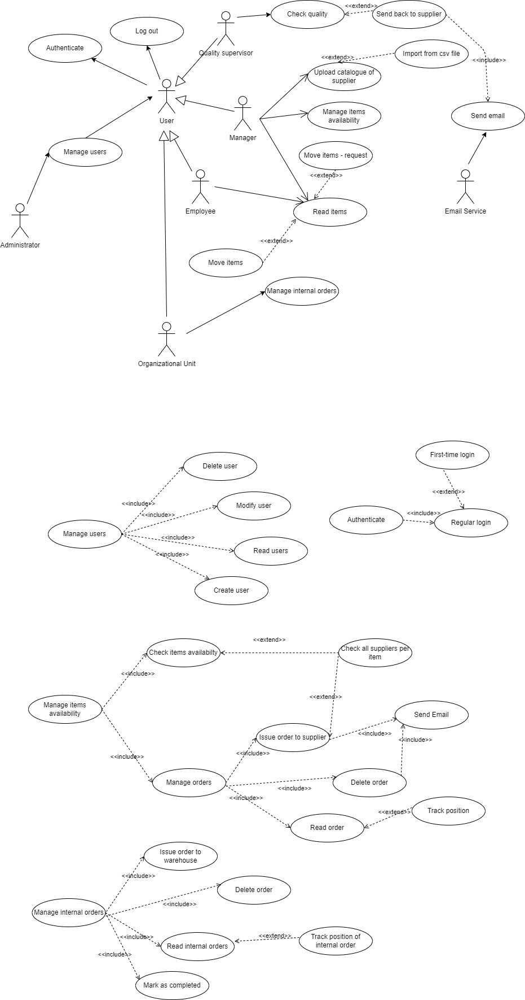
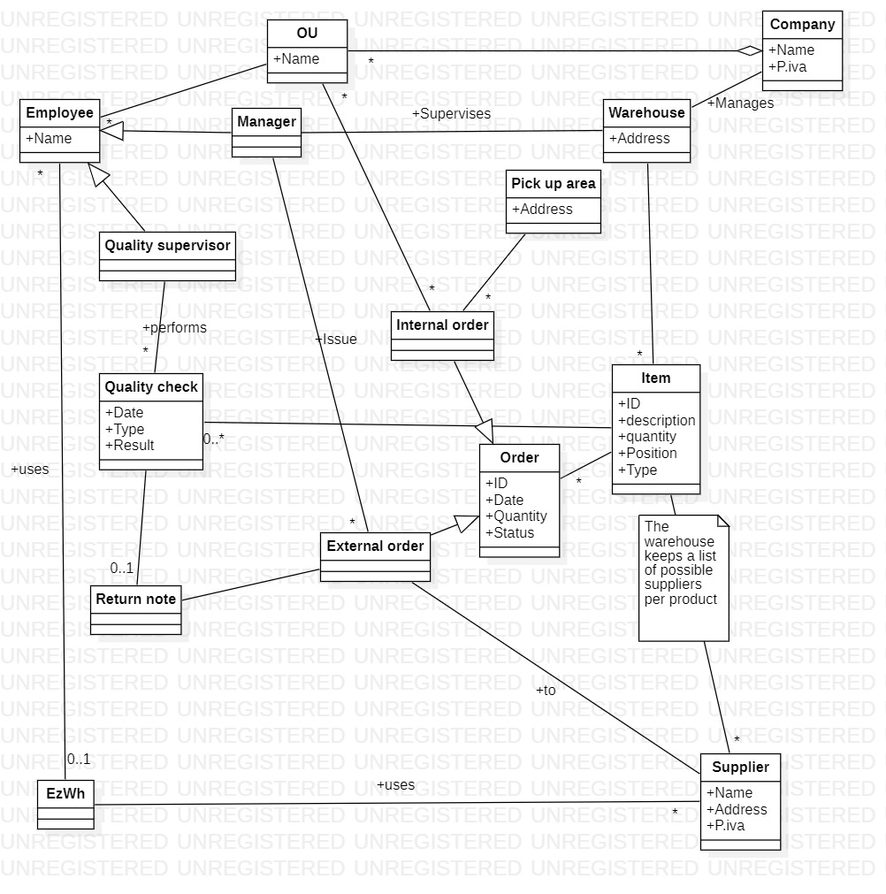

 #Requirements Document 

Authors: 
* Alessio Carachino
* Samuele Giangreco
* Daniel Guarecuco
* Zoltan Mazzuco

Date: 22 march 2022

Version: 0.2

 
| Version number 	| Change 	 |
| ----------------- |:-----------|
| 0.1 				| Describing stakeholders, adding a few UCs			| 
| 0.2 				| Describing stakeholders in detail, adding more UCs| 
| 0.3 				| 	| 

# Contents

- [Contents](#contents)
- [Informal description](#informal-description)
- [Stakeholders](#stakeholders)
- [Context Diagram and interfaces](#context-diagram-and-interfaces)
	- [Context Diagram](#context-diagram)
	- [Interfaces](#interfaces)
- [Stories and personas](#stories-and-personas)
- [Functional and non functional requirements](#functional-and-non-functional-requirements)
	- [Functional Requirements](#functional-requirements)
	- [Non Functional Requirements](#non-functional-requirements)
- [Use case diagram and use cases](#use-case-diagram-and-use-cases)
	- [Use case diagram](#use-case-diagram)
		- [Use case 1, UC1 - Manage users](#use-case-1-uc1---manage-users)
				- [Scenario 1.1](#scenario-11)
				- [Scenario 1.2](#scenario-12)
				- [Scenario 1.3](#scenario-13)
				- [Scenario 1.4](#scenario-14)
		- [Use case 2, UC2 - Manage login](#use-case-2-uc2---manage-login)
				- [Scenario 2.1](#scenario-21)
				- [Scenario 2.2](#scenario-22)
		- [Use case 3, UC3 - Manage inventory](#use-case-3-uc3---manage-inventory)
				- [Scenario 3.1](#scenario-31)
				- [Scenario 3.2](#scenario-32)
				- [Scenario 3.3](#scenario-33)
				- [Scenario 3.4](#scenario-34)
				- [Scenario 3.5](#scenario-35)
				- [Scenario 3.6](#scenario-36)
				- [Scenario 3.7](#scenario-37)
		- [Use case 4, UC4 - Manage orders to suppliers](#use-case-4-uc4---manage-orders-to-suppliers)
		- [Use case 5, UC5 - Manage orders from OU](#use-case-5-uc5---manage-orders-from-ou)
		- [Use case 6, UC6 - Manage shipping](#use-case-6-uc6---manage-shipping)
- [Glossary](#glossary)
- [System Design](#system-design)
- [Deployment Diagram](#deployment-diagram)

# Informal description
Medium companies and retailers need a simple application to manage the relationship with suppliers and the inventory of physical items stocked in a physical warehouse. 
The warehouse is supervised by a manager, who supervises the availability of items. When a certain item is in short supply, the manager issues an order to a supplier. In general the same item can be purchased ~~by~~ from many suppliers. The warehouse keeps a list of possible suppliers per item. 

After some time the items ordered to a supplier are received. The items must be quality checked and stored in specific positions in the warehouse. The quality check is performed by specific roles (quality office), who apply specific tests for item (different items are tested differently). Possibly the tests are not made at all, or made randomly on some of the items received. If an item does not pass a quality test it may be rejected and sent back to the supplier. 

Storage of items in the warehouse must take into account the availability of physical space in the warehouse. Further the position of items must be traced to guide later recollection of them.

The warehouse is part of a company. Other organizational units (OU) of the company may ask for items in the warehouse. This is implemented via internal orders, received by the warehouse. Upon reception of an internal order the warehouse must collect the requested item(s), prepare them and deliver them to a pick up area. When the item is collected by the other OU the internal order is completed. 

EZWH (EaSy WareHouse) is a software application to support the management of a warehouse.

# Stakeholders

| Stakeholder name  		| Description | 
| ----------------- 		|:-----------:|
|   Manager		    		| Uses the application to issue, delete or edit orders to suppliers    | 
|   Supplier	   			| Uses the application to view and accept orders from the Warehouse    | 
|   Quality supervisor    	| Uses the application to rate the quality of the items				   | 
|   Retailer     			| Uses the application to issue, delete or edit orders to the Warehouse|
|   Company's OU    		| Uses the application to issue, delete or edit orders to the Warehouse| 
|   Shipping company     	| Uses the application to get addresses for shipping    			   | 
|   Employee	   			| Uses the applicaiton to list orders					               | 
|   Financial Unit  		| Uses the application to list owed orders and pay for them through a payment service |
|   Physical organization  	| Application maps the physical layout of the Warehouse, used for internal item tracking  | 
|   Pick up area  			| Physical space at the Warehouse where to place items to be picked up | 
|   Administrator   		| Defines roles of all involved parties that use the application       | 
|   Competitor      		|             | 
|   Local policy 	  		| Regulates physical space, allowed items, licenses        			   | 
|   Payment Service 		| Handles payment between parties. Not cover by the EZWZ           	   |

# Context Diagram and interfaces

## Context Diagram

## Interfaces

| Actor | Logical Interface | Physical Interface  |
| ------------- |:-------------:| :-----|
|   Employee     		| GUI | Internet connection, Smartphone/PC |
|   User     			| GUI | Internet connection, Smartphone/PC |
|   Manager     		| GUI | Internet connection, Smartphone/PC |
|   Quality supervisor  | GUI | Internet connection, Smartphone/PC  |
|   Payment service     | APIs| Internet connection |
|   Organizational unit | GUI | Internet connection, Smartphone/PC |
|   Supplier     		| GUI | Internet connection, Smartphone/PC | 
|   Retailer     		| GUI | Internet connection, Smartphone/PC |
|   IT Administrator	| GUI | Internet connection, Smartphone/PC |

# Stories and personas
\<A Persona is a realistic impersonation of an actor. Define here a few personas and describe in plain text how a persona interacts with the system>

\<Persona is-an-instance-of actor>

\<stories will be formalized later as scenarios in use cases>

# Functional and non functional requirements

## Functional Requirements

| ID        | Description  |
| ------------- |:-------------| 
|  FR1    	| Manage users  |
|  FR1.1    | Define a new user, or modify an existing user  |
|  FR1.2	| Delete a user | 
|  FR1.3  	| List all users | 
|  FR1.4  	| Search a user | 
|  FR1.5  	| Manage roles Authorize access to functions to specific actors according to access roles | 
|  FR2  	| Manage orders | 
|  FR2.1  	| Create/Receive orders | 
|  FR2.2  	| Modify/delete an order | 
|  FR2.3  	| Provide order status |
|  FR3  	| Manage items | 
|  FR3.1  	| Check quality |
|  FR3.2  	| Reject the item |
|  FR3.3  	| Track position | 
|  FR3.4  	| Quantity reports |
|  FR3.5  	| Modify Quantity |
|  FR3.6  	| Search an item |
|  FR4  	| Receive payments |
|  FR5  	| Log in |
|  FR5.1  	| Log out |

## Non Functional Requirements

| ID        | Type (efficiency, reliability, ..)           | Description  | Refers to |
| ------------- |:-------------:| :-----| -----:|
|  NFR1     | Efficiency  	| All functions should complete in < 0.5 sec  | |
|  NFR2     | Reliability 	| Percentage of time the product is / is not available to end user | |
|  NFR3     | Correctness 	| Capability to provide intended functionality in ALL cases | |
|  NFR3     | Usability 	| Effort needed to learn using the product | |
|  NFR3     | Security 		| Access only to authorized users | |
|  NFR4		| Domain 		| Currency is Euro | | 

# Use case diagram and use cases

## Use case diagram

### Use case 1, UC1 - Manage users
| Actors Involved        | IT Administrator, User |
| ------------- |:-------------| 
|  Precondition     | Defined at each scenario |
|  Post condition   | Defined at each scenario |
|  Nominal Scenario | Manage users' accounts   |
|  Exceptions     	| Defined at each scenario |

##### Scenario 1.1 

| Scenario 1.1 | Create user |
| ------------- |:-------------| 
|  Precondition     | User U does not exist |
|  Post condition   | User U exists |
|  Step#			| Description 				|
|  1   				| IT Administrator asks the system to create account of User U   |  
|  2  				| Application asks for name, surname, email, working role |
|  3  				| IT Administrator enters name, surname, email, working role |
|  4  				| Application checks wheter there is no other account with the specified information   |
|  5  				| Application creates account for user U   |
|  Exception     	| User U already exists but with different working role, abort |
|  Exception     	| User U already exists but with same working role, the system deletes the old one and create the new one |

##### Scenario 1.2

| Scenario 1.2 | Read users |
| ------------- |:-------------| 
|  Precondition     | IT Administrator is logged in the system |
|  Post condition   | - |
|  Step#			| Description 				|
|  1     			| IT Administrator asks the system to access to users' overview in tabular format|  
|  2     			| System provides the requested information |
|  3     			| IT Administrator picks one of the users to read more details  |
|  4     			| System provides user's details  |
|  Variants     	| Search by user id/name+surname. The system shows the user's details  |
|  Variants     	| Sort by role. The system shows users in hierarchical order   |
|  Variants     	| Sort by seniority. The system shows users in ascending order   |

##### Scenario 1.3

| Scenario 1.3 | Modify user |
| ------------- |:-------------| 
|  Precondition     | IT Administrator is logged in the system |
|  Post condition   | One or more users have been modified |
|  Step#			| Description 				|
|  1     			| IT Administrator asks the system to access to users' overview in tabular format|  
|  2     			| System provides the requested informations |
|  3     			| IT Administrator selects a user U to modify  |
|  4     			| System provides user's details  |
|  5     			| IT Administrator modifies U's information and/or working role  |
|  6     			| Application updates U's informations  |
|  Variants     	| Search by user id/name+surname. The system shows the user's details  |
|  Variants     	| Sort by role. The system shows users in hierarchical order   |
|  Variants     	| Sort by seniority. The system shows users in ascending order   |
|  Exception     	| Selected User U's permissions block the request, abort |

##### Scenario 1.4

| Scenario 1.1 | Delete user |
| ------------- |:-------------| 
|  Precondition     | IT Administrator is logged in the system |
|  Post condition   | User U is deleted |
|  Step#			| Description 				|
|  1     			| IT Administrator asks the system to access to users' overview in tabular format  |  
|  2     			| System provides the requested informations |
|  3     			| IT Administrator selects a user U to delete  |
|  4     			| System provides user's details  |
|  5     			| IT Administrator deletes User U  |
|  6     			| Application updates U's status  |
|  Variants     	| Search by user id/name+surname. The system shows the user's details  |
|  Variants     	| Sort by role. The system shows users in hierarchical order   |
|  Variants     	| Sort by seniority. The system shows users in ascending order   |
|  Exception     	| Selected User U's permissions block the request, abort |

### Use case 2, UC2 - Manage login
| Actors Involved        | IT Administrator, User |
| ------------- |:-------------| 
|  Precondition     | User U exists |
|  Post condition   | Defined at each scenario |
|  Nominal Scenario | Manage users' accounts   |
|  Exceptions     	| Defined at each scenario |

##### Scenario 2.1

| Scenario 2.1 | First-time login |
| ------------- |:-------------| 
|  Precondition     | User U exist |
| 				    | First time User U logs into the application |
|  Post condition   | User U logs in |
|  Post condition   | User U's password is modified |
|  Step#			| Description 				|
|  1   				| User U whishes to log in  to the application |  
|  2  				| Application asks for email and password |
|  3  				| User U provides the default password |
|  4  				| Application prompts the user to change the password |
|  5  				| User U provides a new different password |
|  6				| Application validates the new password and allows access to the user |
|  Exception     	| User U enters wrong default password, abort |
|  Exception     	| User U refuses to change password, abort |
|  Exception     	| New password doesn't comply with password policy, abort |

##### Scenario 2.2

| Scenario 2.2 | Regular login |
| ------------- |:-------------| 
|  Precondition     | User U exist |
|  Post condition   | User U logs in |
|  Step#			| Description 				|
|  1   				| User U whishes to log in  to the application |  
|  2  				| Application asks for email and password |
|  3  				| User U provides the password |
|  4				| Application validates the password and allows access to the user |
|  Exception     	| User U enters wrong password, abort |

### Use case 3, UC3 - Manage inventory

| Actors Involved        | Manager, Payment Service |
| ------------- |:-------------| 
|  Precondition     	| Manager is logged in the system |
|  Post condition     	| Items' inventory has been managed |
|  Nominal Scenario     | \<Textual description of actions executed by the UC> |
|  Exceptions     		| \<exceptions, errors > |

##### Scenario 3.1 

| Scenario 3.1 | Check items availabilty |
| ------------- |:-------------| 
|  Precondition     	|  |
|  Post condition   	|  |
|  Nominal Scenario     | Manager selects the kind of search (sort by category, price, ..., find by id); the system provides the results with corresponding availability  |

##### Scenario 3.2 

| Scenario 3.2 | Check all suppliers per item |
| ------------- |:-------------| 
|  Precondition     	| An item has been selected by the Manager |
|  Post condition     	|  |
|  Nominal Scenario     | Manager asks the system to access to the list of suppliers for the specified item; The system provides the results  |
|  Exceptions     		| No suppliers available for the specified item, abort |

##### Scenario 3.3 

| Scenario 3.3 | Manage orders |
| ------------- |:-------------| 
|  Precondition   	  |  |
|  Post condition     | Orders has been managed  |
|  Nominal Scenario   | Manager asks the system to access to the list of orders (pending and completed); The system provides the results  |

##### Scenario 3.4

| Scenario 3.4 | Issue order to supplier |
| ------------- |:-------------| 
|  Precondition       |  |
|  Post condition     | An order has been issued to the selected supplier |
|  Step#			  |	Description 				|
|  1    			  | Manager enters a list of products with the relating quantity and supplier |  
|  2     			  | System compute final price |
|  3     			  | Manager enters credentials into payment service |
|  4     			  | Manager confirms the payment  |
|  5     			  | System provides the receipt and sends it to the Manager's specified email address  |
|  Exceptions     	  | Payment service respondes with error, abort |

##### Scenario 3.5

| Scenario 2.5 | Read order |
| ------------- |:-------------:| 
|  Precondition     	| Manager has chosen an order among those provided by the System |
|  Post condition     	| |
|  Nominal Scenario     | The system provides the status (pending, completed) of the selected order with addiotional details (date of order, date of delivery, items, qty, price, ...) |

##### Scenario 3.6

| Scenario 3.6 | Track position |
| ------------- |:-------------| 
|  Precondition     	| Manager has chosen an order among those provided by the System |
|  Post condition     	|  |
|  Nominal Scenario     | Manager asks the system to access to the shipping informations; The system provides the results  |
|  Exceptions     		| Shipping informations are not yet available, abort |

##### Scenario 3.7

| Scenario 3.7 | Delete order |
| ------------- |:-------------| 
|  Precondition     	| Manager has chosen an order among those provided by the System. The order must be in pending status and must not be shipped |
|  Post condition     	| The order has been deleted and won't be shipped |
|  Nominal Scenario     | Manager asks the system to delete the order; The system deletes the order and sends a refund request to the email address of the supplier  |
|  Exceptions     		|  Order's deletion rejected due to supplier policies, abort |

### Use case 4, UC4 - Manage orders to suppliers

| Actors Involved       | Manager |
| ------------- |:-------------| 
|  Precondition     	| Manager is logged in the system |
|  Post condition     	| Order to supplier is issued |
|  Nominal Scenario     | When stock is low, manager creates an order to suppliers with needed items |
|  Exceptions     		| Items X is not available at supplier Y. Dissmis Item from order |

### Use case 5, UC5 - Manage orders from OU

| Actors Involved        | Employee|
| ------------- |:-------------| 
|  Precondition     	| Privileged employee of OU or retailer is logged in |
|  Post condition     	| Internal order to the Warehouse is issued |
|  Nominal Scenario     | An employee of an OU generates an internal order requesting items from the warehouse. It's only possible to request items with current availability |
|  Exceptions     		| Item is not available at the warehouse, dismiss this the item from the order |

### Use case 6, UC6 - Manage shipping

| Actors Involved        | Supplier, Retailer, Shipping company, Employee, Quality supervisor|
| ------------- |:-------------| 
|  Precondition     	| A valid order exists in the system 	|
|  Post condition     	| Order is marked as executed 			|
|  Nominal Scenario     | In case of external orders: A shipping company picks up the items at the supplier's address and delivers it to the Warehouse's address.  |
|  					    | In case of internal orders: A shipping company picks up the items at the Warehouse's pickup area and delivers it to the retailer/OU's address.  |
|  Variants     		|  |
|  Exceptions     		|  |

# Glossary

# System Design
\<describe here system design>

\<must be consistent with Context diagram>

# Deployment Diagram 

\<describe here deployment diagram >

