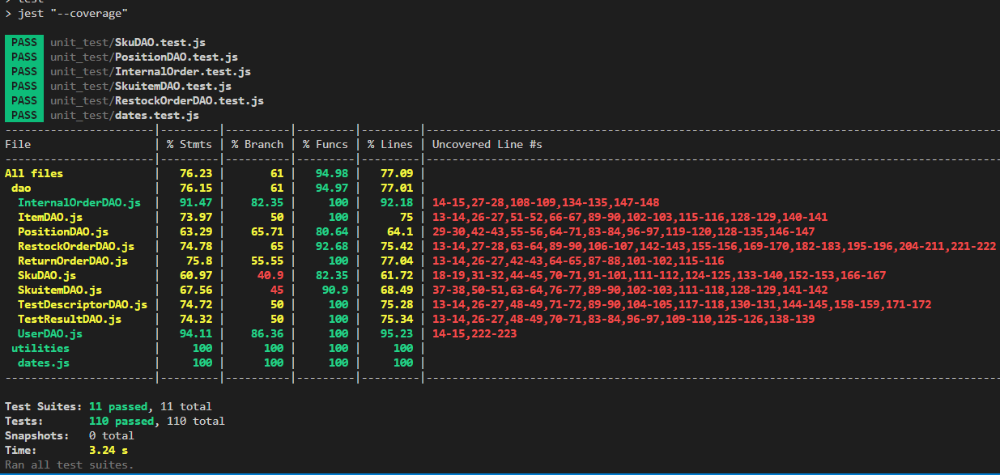

# Unit Testing Report

Date:

Version:

# Contents

- [Black Box Unit Tests](#black-box-unit-tests)

- [White Box Unit Tests](#white-box-unit-tests)

# Black Box Unit Tests

    <Define here criteria, predicates and the combination of predicates for each function of each class.
    Define test cases to cover all equivalence classes and boundary conditions.
    In the table, report the description of the black box test case and (traceability) the correspondence with the Jest test case writing the 
    class and method name that contains the test case>
    <Jest tests  must be in code/server/unit_test  >

 ### **Class *class_name* - method *name***

**Criteria for method *name*:**
	

 - 
 - 

**Predicates for method *name*:**

| Criteria | Predicate |
| -------- | --------- |
|          |           |
|          |           |
|          |           |
|          |           |

**Boundaries**:

| Criteria | Boundary values |
| -------- | --------------- |
|          |                 |
|          |                 |

**Combination of predicates**:

| Criteria 1 | Criteria 2 | ... | Valid / Invalid | Description of the test case | Jest test case |
|-------|-------|-------|-------|-------|-------|
|||||||
|||||||
|||||||
|||||||
|||||||

# White Box Unit Tests

### Test cases definition
    
    
    <Report here all the created Jest test cases, and the units/classes under test >
    <For traceability write the class and method name that contains the test case>

| Unit name | Jest test case |
|--|--|
|Test Unit - Item | ItemDAO.test.js --> AddItem() |
|Test Unit - Item | ItemDAO.test.js --> testEditItem() |
|Test Unit - Item | ItemDAO.test.js --> testGetItems() |
|Test Unit - Item | ItemDAO.test.js -->testGetItem() |
|Test Unit - Item | ItemDAO.test.js --> testDeleteItem() |
|Test Unit - Item | ItemDAO.test.js --> testDeleteAllItems() |
|Test Unit - Test Descriptor | TestDescriptorDAO.test.js --> testAddTest() |
|Test Unit - Test Descriptor | TestDescriptorDAO.test.js --> testEditTest() |
|Test Unit - Test Descriptor | TestDescriptorDAO.test.js --> testGetTests() |
|Test Unit - Test Descriptor | TestDescriptorDAO.test.js --> testGetTest() |
|Test Unit - Test Descriptor | TestDescriptorDAO.test.js --> testFindName() |
|Test Unit - Test Descriptor | TestDescriptorDAO.test.js --> testIdFromSku() |
|Test Unit - Test Descriptor | TestDescriptorDAO.test.js --> testDeleteTest() |
|Test Unit - Test Descriptor | TestDescriptorDAO.test.js --> testDeleteAllTests() |
|Test Unit - Test Result | TestResultDAO.test.js --> testAddResult() |
|Test Unit - Test Result | TestResultDAO.test.js --> testEditResult() |
|Test Unit - Test Result | TestResultDAO.test.js --> testGetResultsRfid() |
|Test Unit - Test Result | TestResultDAO.test.js --> testGetResultsRfidId() |
|Test Unit - Test Result | TestResultDAO.test.js --> countFailed() |
|Test Unit - Test Result | TestResultDAO.test.js --> testDeleteResult() |
|Test Unit - Test Result | TestResultDAO.test.js --> testDeleteAllResults() |
|Test User               | UserDAO.test.js --> testAddUser() |
|Test User               | UserDAO.test.js --> testEditUser() |
|Test User               | UserDAO.test.js --> testCheckStored() |
|Test User               | UserDAO.test.js --> testGetUserByEmailType() |
|Test User               | UserDAO.test.js --> testGetUsers() |
|Test User               | UserDAO.test.js --> testGetSuppliers() |
|Test User               | UserDAO.test.js --> testGetUsersWithoutManagers() |
|Test User               | UserDAO.test.js --> testDeleteUser() |
|Test Internal Order     | InternalOrder.test.js --> testAddInternalOrder() |
|Test Internal Order     | InternalOrder.test.js --> testAddInternalOrderProducts() |
|Test Internal Order     | InternalOrder.test.js --> testCheckIfOrderExists() |
|Test Internal Order     | InternalOrder.test.js --> testUpdateInternalOrder() |
|Test Internal Order     | InternalOrder.test.js --> testUpdateInternalOrderProduct() |
|Test Internal Order     | InternalOrder.test.js --> testDeleteInternalOrder() |
|Test Internal Order     | InternalOrder.test.js --> testDeleteInternalOrderProducts() |
|Test Internal Order     | InternalOrder.test.js --> testGetInternalOrder() |
|Test Internal Order     | InternalOrder.test.js --> testGetInternalOrderProducts() |
|Test Internal Order     | InternalOrder.test.js --> testGetInternalOrderProductsCompleted() |
|Test Internal Order     | InternalOrder.test.js --> testGetInternalOrdersByState() |
|Test Internal Order     | InternalOrder.test.js --> testGetInternalOrdersbyID() |
||||

### Code coverage report

    <Add here the screenshot report of the statement and branch coverage obtained using
    the coverage tool. >

### Loop coverage analysis

    <Identify significant loops in the units and reports the test cases
    developed to cover zero, one or multiple iterations >

|Unit name | Loop rows | Number of iterations | Jest test case |
|---|---|---|---|
|||||
|||||
||||||

