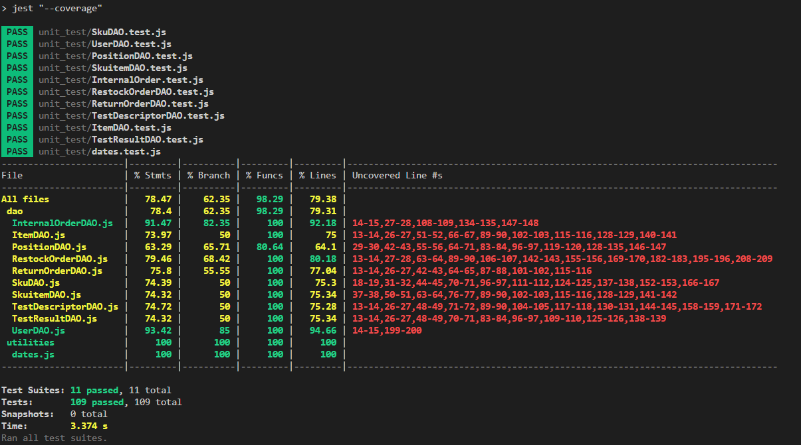

# Unit Testing Report

Date: 25/05/2022

Version: 01

# Contents

- [Black Box Unit Tests](#black-box-unit-tests)

- [White Box Unit Tests](#white-box-unit-tests)

# Black Box Unit Tests

    <Define here criteria, predicates and the combination of predicates for each function of each class.
    Define test cases to cover all equivalence classes and boundary conditions.
    In the table, report the description of the black box test case and (traceability) the correspondence with the Jest test case writing the 
    class and method name that contains the test case>
    <Jest tests  must be in code/server/unit_test  >

 ### **Class *class_name* - method *name***

**Criteria for method *name*:**
	

 - 
 - 

**Predicates for method *name*:**

| Criteria | Predicate |
| -------- | --------- |
|          |           |
|          |           |
|          |           |
|          |           |

**Boundaries**:

| Criteria | Boundary values |
| -------- | --------------- |
|          |                 |
|          |                 |

**Combination of predicates**:

| Criteria 1 | Criteria 2 | ... | Valid / Invalid | Description of the test case | Jest test case |
|-------|-------|-------|-------|-------|-------|
|||||||
|||||||
|||||||
|||||||
|||||||

# White Box Unit Tests

### Test cases definition
    

| Unit name | Jest test case |
|--|--|
|Item | ItemDAO.test.js --> AddItem() |
|Item | ItemDAO.test.js --> testEditItem() |
|Item | ItemDAO.test.js --> testGetItems() |
|Item | ItemDAO.test.js -->testGetItem() |
|Item | ItemDAO.test.js --> testDeleteItem() |
|Item | ItemDAO.test.js --> testDeleteAllItems() |
|Test Descriptor | TestDescriptorDAO.test.js --> testAddTest() |
|Test Descriptor | TestDescriptorDAO.test.js --> testEditTest() |
|Test Descriptor | TestDescriptorDAO.test.js --> testGetTests() |
|Test Descriptor | TestDescriptorDAO.test.js --> testGetTest() |
|Test Descriptor | TestDescriptorDAO.test.js --> testFindName() |
|Test Descriptor | TestDescriptorDAO.test.js --> testIdFromSku() |
|Test Descriptor | TestDescriptorDAO.test.js --> testDeleteTest() |
|Test Descriptor | TestDescriptorDAO.test.js --> testDeleteAllTests() |
|Test Result | TestResultDAO.test.js --> testAddResult() |
|Test Result | TestResultDAO.test.js --> testEditResult() |
|Test Result | TestResultDAO.test.js --> testGetResultsRfid() |
|Test Result | TestResultDAO.test.js --> testGetResultsRfidId() |
|Test Result | TestResultDAO.test.js --> countFailed() |
|Test Result | TestResultDAO.test.js --> testDeleteResult() |
|Test Result | TestResultDAO.test.js --> testDeleteAllResults() |
|User               | UserDAO.test.js --> testAddUser() |
|User               | UserDAO.test.js --> testEditUser() |
|User               | UserDAO.test.js --> testCheckStored() |
|User               | UserDAO.test.js --> testGetUserByEmailType() |
|User               | UserDAO.test.js --> testGetUsers() |
|User               | UserDAO.test.js --> testGetSuppliers() |
|User               | UserDAO.test.js --> testGetUsersWithoutManagers() |
|User               | UserDAO.test.js --> testDeleteUser() |
|Internal Order     | InternalOrder.test.js --> testAddInternalOrder() |
|Internal Order     | InternalOrder.test.js --> testAddInternalOrderProducts() |
|Internal Order     | InternalOrder.test.js --> testCheckIfOrderExists() |
|Internal Order     | InternalOrder.test.js --> testUpdateInternalOrder() |
|Internal Order     | InternalOrder.test.js --> testUpdateInternalOrderProduct() |
|Internal Order     | InternalOrder.test.js --> testDeleteInternalOrder() |
|Internal Order     | InternalOrder.test.js --> testDeleteInternalOrderProducts() |
|Internal Order     | InternalOrder.test.js --> testGetInternalOrder() |
|Internal Order     | InternalOrder.test.js --> testGetInternalOrderProducts() |
|Internal Order     | InternalOrder.test.js --> testGetInternalOrderProductsCompleted() |
|Internal Order     | InternalOrder.test.js --> testGetInternalOrdersByState() |
|Internal Order     | InternalOrder.test.js --> testGetInternalOrdersbyID() |
|Sku | SkuDAO.test.js --> testgetSkus() |
|Sku | SkuDAO.test.js --> testgetSku() |
|Skuitem | SkuitemDAO.test.js --> testgetSkuitem() |
|Skuitem | SkuitemDAO.test.js --> testgetSkuitems() |
|Skuitem | SkuitemDAO.test.js --> testgetAvailableSkuitem() |
|Position | PositionDAO.test.js --> testUpdatePosition() |
|Position | PositionDAO.test.js --> testChangePosition() |
|Position | PositionDAO.test.js --> testUpdateDimensions() |
|RestockOrder| RestockOrderDAO.test.js --> testAddRestockOrder()  |
|RestockOrder| RestockOrderDAO.test.js --> testCheckIfStored()  |
|RestockOrder| RestockOrderDAO.test.js --> testGetIssuedRestockOrders()  |
|RestockOrder| RestockOrderDAO.test.js --> testGetAllRestockOrders()  |
|RestockOrder| RestockOrderDAO.test.js --> testGetIssuedOrder()  |
|RestockOrder| RestockOrderDAO.test.js --> testGetNotIssuedOrder()   |
|RestockOrder| RestockOrderDAO.test.js --> testGetDeliveryOrder()  |
|RestockOrder| RestockOrderDAO.test.js --> testUpdateState()  |
|RestockOrder| RestockOrderDAO.test.js --> testUpdateTransportNote()  |
|RestockOrder| RestockOrderDAO.test.js --> testUpdateSkuItems()  |
|RestockOrder| RestockOrderDAO.test.js --> testDeleteRestockOrder()  |
|ReturnOrder| ReturnOrderDAO.test.js --> testAddReturnOrder()  |
|ReturnOrder| ReturnOrderDAO.test.js --> testGetAllReturnOrders()  |
|ReturnOrder| ReturnOrderDAO.test.js --> testCheckIfRestockOrderIsStored()  |
|ReturnOrder| ReturnOrderDAO.test.js --> testDeleteReturnOrder()  |

### Code coverage report

### Loop coverage analysis

    <Identify significant loops in the units and reports the test cases
    developed to cover zero, one or multiple iterations >

|Unit name | Loop rows | Number of iterations | Jest test case |
|---|---|---|---|
|||||
|||||
||||||

